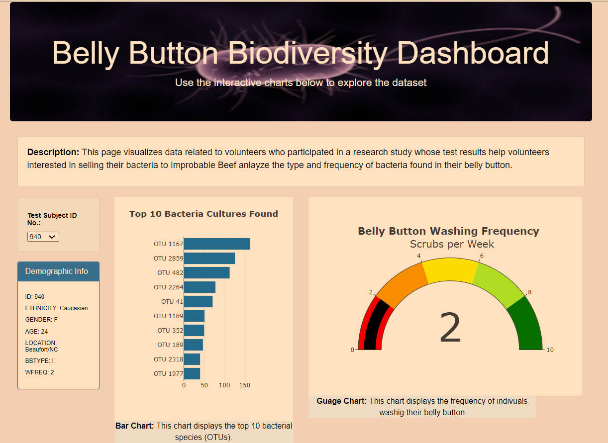

# Belly Button BioDiversity Dashboard

## Project Description

In this project, I create an interactive dynamic dashboard including an dropdown to select IDs, a panel to display individuals' demographic infomration, a horizontal bar sorting the top 10 bacteria species in individuals' belly button identified by their unique IDs, a bubble chart presenting bacteria IDs against their sample values, and finally a gauge chart indicating the frequency of individuals washing their belly buttons. To enhance quality of dashboard, I also utlized several customizations such as embedding additional information, adding images, and differentiating colors.

In doing so, I write HTML and Javascript codes to read a .json dataset and build a dynamic dashboard which can be accessed on a web page. Below is a screenshots of different parts of the dashboard displaying information related to the indiciual with user ID of 940.

